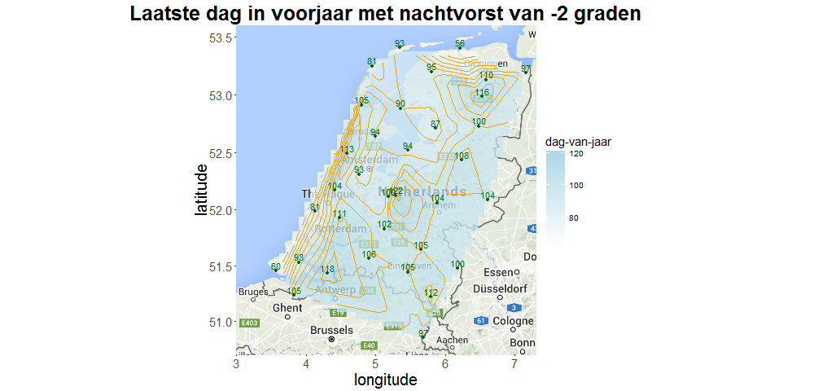
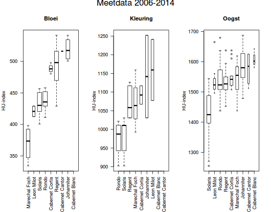
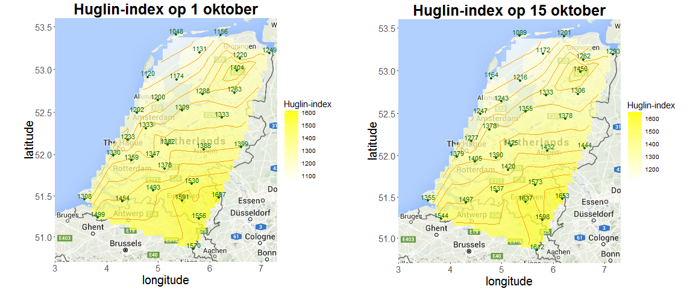
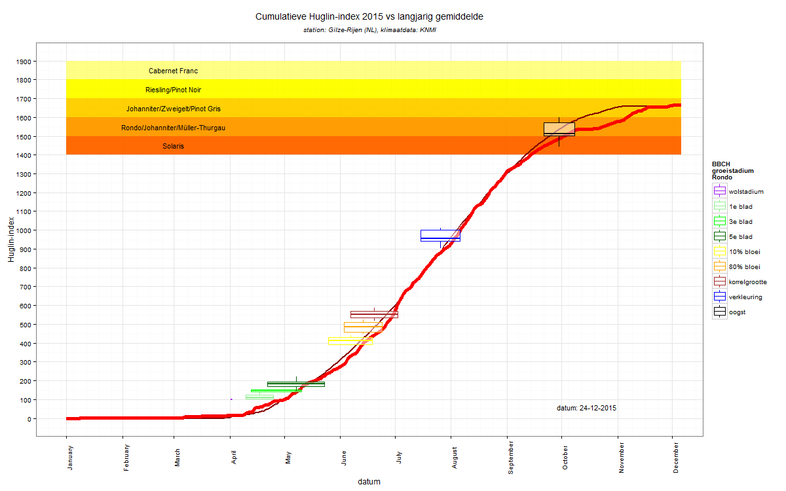

# Doel

Onderzoek naar de geschiktheid van de diverse druivenrassen voor de druiventeelt in Nederland op basis van data over de groeifasen van druiven gecombineerd met klimatologische data.

De verwachte uitkomst is een classificatie van de druivenrassen (vroeg/midden/laat), de kans op misoogst door schade door een late nachtvorst en de kans op een onrijpe oogst.

# Achtergrond

De toename van de wijnbouw in Nederland steunt op de beschikbaarheid van druivenrassen die geschikt zijn voor het Nederlandse klimaat. Een toenemende beschikbaarheid van zogenaamde schimmel-tolerante rassen draagt hier sterk aan bij. De beschrijving van hun eigenschappen is momenteel uitsluitend gebaseerd op ervaringen met deze rassen in de landen waar deze rassen zijn ontwikkeld (metname Duitsland en Zwitserland).    
Een overzicht van schimmel-tolerante rassen kan worden gevonden op de [website van de Brabantse Wijnbouwers](http://www.brabantsewijnbouwers.nl/index.php?section=13&page=132&student=416).

Dat men in Nederland nog zoekende is naar de meest optimale druivenrassen blijkt bijv. uit het feit dat bij de ruim 450 leden van de Brabantse Wijnbouwers zo'n 100 verschillende rassen staan aangeplant.  
Kijkt men naar een regio in één van de traditionele wijnbouwlanden, dan is dit meestal minder dan 15.

Op basis van [plantkundige kenmerken](http://www.brabantsewijnbouwers.nl/index.php?section=13&category=&page=82), zoals moment van uitlopen, bloei, verkleuring (begin rijping) en oogstdata, en klimatologische gegevens, zoals [de Huglin-index](http://www.brabantsewijnbouwers.nl/index.php?section=13&page=57&student=1171) (een som van de graaddagen, ofwel een maat voor de warmte tijdens het groeiseizoen), kan men de druivenrassen indelen in vroeg-/laatuitlopende en vroeg-/laatrijpende rassen.  
Op basis van deze categorisatie kan de wijnbouwer een betere keuze maken door de kans op schade door een late nachtvorst of de kans op een onrijpe oogst te minimaliseren.


# Opzet

Op basis van de groeigegevens van de verschillende druivenrassen die zijn aangeplant bij de leden van de Brabantse Wijnbouwers, waaronder datum van uitloop, bloei, verkleuring, oogst en oostgegevens zoals suikergehalte en zuurgraad, en klimaatdata van het KNMI kan men de verschillende druivenrassen categoriseren.

Een voorbeeld van de groeidata wordt gegeven in de volgende tabel.
```{r laadDeelnemers, echo=FALSE, warning=FALSE, error=TRUE}
rijping <- read.csv("./data/BWB_rijpings_en_oogstgegevens.csv", 
                       header = TRUE, 
                       sep = "~", 
                       comment.char = "#")
load("./data/ledenBWB.RData")
t <- merge(rijping, ledenBWB[,c("wijngaard", "lat", "lon")], by="wijngaard")
rijping <- t[sort(t$druivenras, decreasing = TRUE),]

write.table(rijping, "./data/BWB_druiven_rijping.csv", sep="~")

library(knitr)
kable(head(rijping[rijping$druivenras=="Rondo",c("wijngaard", "lat", "lon", "druivenras", "oe", "zuur", "oogst", "bloei", "rijping")]),
      caption="Groeifasen en rijping druivenrassen")
```

De kolommen "oe" en "zuur" zijn een maat voor de rijpheid van de druiven bij oogst. Een suikergehalte (uitgedrukt in "oe") onder de 70 of een zuur dat hoger is dan 11g/L voor witte druiven of 8.5g/L voor blauwe druiven duidt op minder rijpe druiven. Deze gegevens kunnen worden gebruikt om een inschatting te maken of de wijnbouwer heeft geoogst uit noodzaak (slecht weer, rot, andere problemen) of bij een optimale rijping (met andere woorden; of de oogstdatum representatief is voor het druivenras).

Vergelijking van het moment van uitloop met contour plots met de (10-jarige gemiddelde) laatste nachtvorst in het voorjaar geeft een idee welke rassen waar in Nederland risico lopen op vorstschade in het voorjaar (en daarmee een mogelijke misoogst).  
Bij een gemiddelde hoort een spreiding, zodat kan worden aangegeven of schade door nachtvorst 'nooit', of bijvoorbeeld eens in de x jaar kan voorkomen.



Vergelijking van de Huglin-index bij oogst met contour plots met de (10-jarige gemiddelde) Huglin-index aan het einde van het groeiseizoen (tussen begin en half oktober) geeft een idee welke rassen waar in Nederland een voldoende rijpheid kunnen bereiken om een goede wijn te geven, m.a.w. welke rassen waar kunnen worden aangeplant. Ook hier kan de kans op een onrijpe oogst worden berekend.






Plots van de groeifases van de druif tegen de Huglin-index bieden een mogelijkheid om de groei te modelleren, bijv. op basis van de [Logistische functie](https://nl.wikipedia.org/wiki/Logistische_functie). Nb. de gekleurde balken tonen literatuurwaarden voor de benodigde Huglin-index voor de verschillende druivenrassen.



Met een beetje 'brainstormen' denk ik dat er uit deze kleine dataset nog meer interesante informatie is te halen.


# Data
Groeidata in CSV-formaat is te vinden via [deze link](http://www.brabantsewijnbouwers.nl/starnet/media/downloads/Wijnbouw/BWB_druiven_rijping.csv) naar de website van de Brabantse Wijnbouwers. Nb. een uitgebreider bestand komt binnenkort beschikbaar. 

Via de geo-locaties van de wijngaarden kan het dichtstbijzijnde [KNMI meetstation](http://www.knmi.nl/samenw/klimatologie/metadata/index.html) worden gevonden.

Klimaatdata voor de verschillende KNMI stations kan worden opgehaald vanaf de KNMI-website, zowel [als zip-file](http://www.knmi.nl/nederland-nu/klimatologie/daggegevens) als [via scripts](http://www.knmi.nl/kennis-en-datacentrum/achtergrond/data-ophalen-vanuit-een-script).


# Literatuur

  1. Einfluss des Klimas auf den Weinbau im Oberen Moseltal, Die Winzer Zeitschrift (November 2014)
  2. [Understanding grape berry development, James Kennedy Practical Winery and Vineyard (July/August) 2002)](http://www.practicalwinery.com/julyaugust02/julaug02p14.htm)
  3. [Zeitpunkt der Traubenreife, Wein-Terroir Burgenland](http://www.wein-terroir.at/web/index.php?seite=seite&id=182)