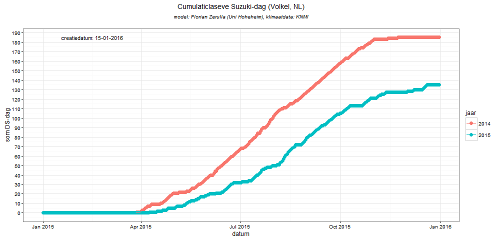

# Doel

Het doel is de ontwikkeling van een praktisch toepasbaar model om de populatiegroei van de, voor de teelt van zachtfruit schadelijke, fruitvlieg Drosophila suzukii te voorspellen. Dit moet het mogelijk maken om tijdig beschermende maatregelen te kunnen nemen.

Door de snelle (exponentiele) populatiegroei en afhankelijkheid van meerdere klimatologische factoren is het voor genoemd fruitvliegje lastig om beschermende maatregelen enkel te baseren op metingen met vallen. Voorspellingen op basis van een model kan helpen actief in plaats van reactief op te treden.


# Achtergrond

Het Suzuki fruitvliegje is, metname in 2014, een grote plaag geweest voor de commerciele en hobbymatige teelt van zachtfruit (aardbeien, frambozen, bramen, kersen, druiven, etc.). In andere Europese landen en de VS vormt dit beestje al langer een plaag en is men gestart met diverse onderzoeken om meer over deze fruitvlieg te weten te komen. Een overzicht van de huidige kennis is beschreven in [1] (zie paragraaf literatuur).

Nb er zijn inmiddels verschillende benamingen voor de Suzuki-fruitvlieg (de in Nederland gangbare benaming), namelijk de officiele naam "Drosophila suzukii", vaak afgekort tot "DS". In de Verenigde Staten wordt "Spotted wing Drosophila" gebruikt. In Duitsland heet hij de "Kirschessigfliege", afgekort tot KEF.


# Bestaande modellen

Er zijn momenteel enkele eenvoudige en meer compleze modellen beschikbaar voor de populatiegroei van de Suzuki fruitvlieg. Een voorbeeld van een eenvoudig model is [2] "[Predicting when Spotted Wing Drosophila begins activity using a Degree-day Model, Len Coop et al.](http://whatcom.wsu.edu/ag/documents/newsletters/v2i3_2013MarchWCENewsletter.pdf)". Een complexer model is bijv. [3] "[Integrating Temperature-Dependent Life Table Data into a Matrix Projection Model for Drosophila suzukii Population Estimation](http://journals.plos.org/plosone/article?id=10.1371/journal.pone.0106909)",  
Beide modellen zijn gebaseerd op slechts ??n parameter; de temperatuur (gegeven in zogenaamde [graaddagen](http://www.brabantsewijnbouwers.nl/index.php?section=13&page=57&student=1171)). Het effect van de temperaruur is nog niet eens volledig geimplementeerd omdat de voortplanting en overleving boven bepaalde temperaturen weer sterk afnemen.

Een andere belangrijke parameter, de relatieve luchtvochtigheid, is voorzover mij bekend, nog niet meegenomen. Met name deze factor maakte het verschil tussen de jaren 2014 (grootschalige aantasting en verlies aan opbrengst in de zachtfruitsector) en 2015.  
Nog een bekende parameter is de windkracht; bij te hoge windsnelheden (>8m/s) vliegt het fruitvliegje niet uit.

Een idee zou kunnen zijn om de graaddag (te zien als een positieve dag voor de ontwikkeling van de fruitvlieg) uit te breiden met meerdere condities. Dit zou kunnen beteken dat een graaddag, ondanks bijv. een positieve temperatuur, toch negatief uitvalt omdat bijv. de luchtvochtigheid te laag. is.

Bekende condities zijn:  

  1. gemiddelde dag temperatuur: ongunstig als gemTemp <10 of >32, zeer gunstig als 20<=gemTemp<=23 en anders gunstig,
  2. (gemiddelde) relatieve vochtigheid: ongunstig als gemRelVocht < 65%, anders gunstig (nb. deze paramater lijkt vooral van invloed in de ochtend en middag),
  3. (gemiddelde) wind; ongunstig als maxWind > 8m/s (5 Beaufort), anders gunstig.

Wanneer deze criteria worden samengebracht in een "Suzuki-dag" (DDds = DDtemp\*DDrelvocht\*DDwind, waarbij voor het gemak 'ongunstig' is vervangen door '0', en 'gunstig' door '1'), dan is meteen te zien dat 2014 al vanaf vroeg in het seizoen een gunstiger jaar was voor de Suzuki fruitvlieg dan 2015.




# Data

Tijdreeksen van de Suzuki fruitvlieg op diverse locaties in Nederland en Belgi? in 2015 zijn beschikbaar  in CSV-formaat via de [website van de Brabantse Wijnbouwers](http://www.brabantsewijnbouwers.nl/starnet/media/downloads/Wijnbouw/BWB_DS_monitoring.csv). Deze gegevens (521 observaties in 2015) zullen in de loop van 2016 worden aangevuld.

Een voorbeeld van de Suzuki fruitvlieg monitoringsdata wordt gegeven in de volgende tabel.
```{r laadDeelnemers, echo=FALSE, warning=FALSE, error=TRUE}
load("./data/monitoringData.RData")

ds <- all.monitoring.data[,c("datum", "aantal", "fruitsoort", "lat", "lon")]
write.table(ds, "./data/BWB_DS_monitoring.csv", sep="~")

library(knitr)
kable(head(ds[10:15,]),
      caption="Drosophia suzuki fruitvlieg monitoringsdata")
```

Op de universiteit Freiburg (DE) wordt een langerlopend (2013-2015) en uitgebreider [Suzuki fruitvlieg monitoringsprogramma](http://www.vitimeteo.de/monitoring/fallenfaenge.shtml) uitgevoerd. Jammer genoeg zijn de tabellen met resultaten niet langer publiekelijk beschikbaar. De data zal nu uit de figuren moeten worden geextraheerd. Nb met name de locatie Sasbach en omgeving is interessant door de grote aantallen vangsten.


# Opzet

Hoewel de beschikbare hoeveelheid data voor deze opdracht kleiner is dan wat 'normaal' is bij een BigData opdracht, komen alle belangrijke aspecten aan bod; bestuderen van het probleem, verzamelen van data, opschonen van data, combineren/verrijken van data, analyseren van de data, modelleren van de data, valideren van het model en documentatie/presentatie van de resultaten.

0. literatuuronderzoek,
1. verzamelen van de veldmetingen m.b.t. fruitvlieg populatie uit monitoringsprogramma's (o.b.v. aanwezige meetdata en o.b.v. "screen-grabben" van websites),
2. opschonen van de data,
3. verrijken van de data o.b.v. historische klimaatdata van het KNMI,
4. implementeren van een populatie groeimodel (o.b.v. modellen uit de literatuur),
5. vergelijken/ijken van model tegen veldmetingen,
6. presentatie van voorspellingen o.b.v. actuele KNMI klimaatdata, inclusief de 10-daagse voorspelling, voor verschillende locaties in Nederland (en Belgie).

Het verslag wordt bij voorkeur uitgewerkt op basis van het uitgangspunt van reproduceerbaar onderzoek, d.w.z. dat data, code en documentatie beschikbaar zijn voor reproductie en vervolgonderzoek.


# literatuur

Bestaande modellen voor de Suzuki-fruitvlieg / KEF / SWD:

  2. [Invasion biology of spotted wing Drosophila (Drosophila suzukii): a global perspective and future priorities](http://www.isaacslab.ent.msu.edu/Images/2015_Asplen%20et%20al_JPS%5B1%5D.pdf)
  1. [Predicting when Spotted Wing Drosophila begins activity using a Degree-day Model, Len Coop et al.](http://whatcom.wsu.edu/ag/documents/newsletters/v2i3_2013MarchWCENewsletter.pdf) pagina 2 en verder.
  1. [Integrating Temperature-Dependent Life Table Data into a Matrix Projection Model for Drosophila suzukii Population Estimation](http://www.plosone.org/article/fetchObject.action?uri=info:doi/10.1371/journal.pone.0106909&representation=PDF)
  2. [Drosophila suzukii population estimation and development of a real-time risk model](http://www.academia.edu/14623376/Drosophila_suzukii_population_estimation_and_development_of_a_real-time_risk_model)
  4. [Humidity affects populations of Drosophila suzukii (Diptera:
Drosophilidae) in blueberry](http://onlinelibrary.wiley.com/doi/10.1111/jen.12247/pdf)

Theoretische beschrijving van populatie modellen:

  1. [Syllabus Andr? M. de Roos, Institute for Biodiversity and Ecosystem Dynamics Population Biology Section](https://staff.fnwi.uva.nl/a.m.deroos/downloads/pdf_readers/syllabus.pdf)
  2. [Syllabus Rob J. de Boer Theoretical Biology & Bioinformatics Utrecht University](http://www-binf.bio.uu.nl/rdb/books/mpd.pdf)
  3. [populatie model gebaseerd op de Leslie matrix (gebruikt om de verschillende levenscycli van bijv. insecten te modelleren)](https://github.com/noamross/Working-Code/blob/master/OldStuff/Les_analysis.R)
