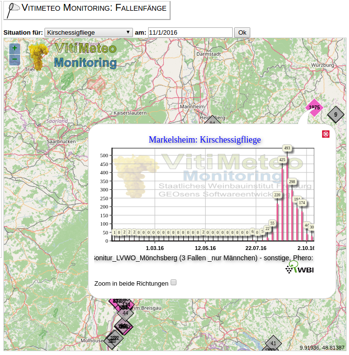

# Achtergrond van de Opdracht

## De hoofdrolspelers

Vrouwtje van de Suzuki-fruitvlieg | Mannetje van de Suzuki-fruitvlieg
---- | ----
 | 

  - nieuw plaaginsect voor de zacht-fruit sector,
  - kan in korte tijd een groot deel van de oogst vernietigen.

## Het probleem?

Het vrouwtje boort gaaf fruit aan om eitjes te leggen.

Aangetast fruit leidt tot micro-biologische aantasting (...rot).

Fruit is daardoor onverkoopbaar/onverwerkbaar

## Het probleem gevisualiseerd

## Video Drosophila suzukii

<iframe width="560" height="315" src="https://www.youtube.com/embed/UsUyc4Jwzps" frameborder="0" allowfullscreen></iframe>

## Huidige maatregelen

*Reactief* nav waarschuwingen obv monitoring:

  - bescherming (netten)
  - verdelging (niet discriminatief)

## Gewenste maatregelen

*Actief* obv *verwachtingen* tav ***de populatie-groei.***

  - bescherming aanbrengen voordat schade onstaat,
  - populatie-groei onder controle houden dmv tijdige maatregelen,
  - 'if all else fails': oogsten voordat de schade te groot wordt...

## Doel

*Een **model** om de **populatie-groei** van de Suzuki-fruitvlieg te **voorspellen***

# Wijnbouw in Nederland

## Nieuwe kansen voor wijnbouw

Wijnbouw in Nederland is (opnieuw) mogelijk door de hogere temperaturen in onze regio.

Kenmerken

  - kleinschalig
  - hoge kosten
  - nieuwe rassen
  - geen ervaring
  - onbekend bij de consument

## Wijnbouw in cijfers

  - 150 professionele wijngaarden
  - 260 hectare oppervlakte
  - 900.000 liter wijn (pm 1.3 miljoen flessen)

*[Wikipedia](https://nl.wikipedia.org/wiki/Wijnbouw_in_Nederland) cijfers 2007*

  - 560 leden (voornamelijk hobby, minderheid professioneel)
  - 80 hectare oppervlakte
  - 322.000 liter wijn (pm 460.000 flessen)

*[BWB](http://www.brabantsewijnbouwers.nl) cijfers 2016*

## Wijngaard Dassemus

<iframe width="560" height="315" src="https://www.youtube.com/embed/0GjhtUc-8L4" frameborder="0" allowfullscreen></iframe>

# Suzuki-fruitvlieg

## Feiten

  - Drosophila suzukii (officiele naam, vaak afgekort tot 'DS')
    + 'Spotted wing Drosophila' (VS)
    + 'Kirschessigfliege' (DE, vaak afgekort tot 'KEF')
  - Japanse/Noord-Oost Aziatische oorsprong
  - recente wereldwijde opmars
    + sinds 2007/2008 in Italië en Spanje
    + sinds 2010/11 in de VS
    + sinds 2012 in Duitsland
    + sinds 2014 in **Nederland**

## Levenscyclus D. suzukii

**levenscyclus**  
afhankelijk van T° en RV, van ei tot volwassenheid:

  - Snelste : 8 dagen  
  - Gemiddeld: 20-30 dagen  

**Eileg per wijfje**  
7-16 eieren/dag, 384 eieren max. in 3-9 weken  
Eileg in de ochtend- en avonduren, vanaf ongeveer april/mei afhankelijk status van vruchten en T°.

**Larve**  
na 12-72 u uit ei (afh. van T°)  
3 larvale stadia in fruit: 3-13 dagen  

**Pop**
in de vrucht of op het oppervlak ervan; 3-15 dagen  
volwassen vliegen 3-15 dagen later  

## Het slechte nieuws

  - weinig natuurlijke vijanden,
  - hoge reproductiesnelheid (300-350 eitjes per vrouwtje),
  - snel opeenvolgende generaties (30 dagen),
  - 6 à 7 generaties per seizoen.

## Alleen slecht nieuws?

Stagnatie van reproductiesnelheid

  + $T_{gem} < 10^o C$
  + $T_{gem} > 35^o C$
  + $RV_{gem} < 65 %$

## Wijnbouwkundige maatregelen

  - loofwand open (zon & wind)
  - onderbegroeing kort (droog)
  - druivenschil verharden (waterglas)
  - waardplanten verwijderen (ondoenlijk...)
  - spuitmiddel (max. 2x/jaar, duur, schadelijk voor bijen, resistentie...)
  - **?**

# Modellen

## Bestaande modellen

Enkele eenvoudige en meer complexe modellen voor de populatiegroei

  - "Predicting when Spotted Wing Drosophila begins activity using a Degree-day Model, Len Coop et al.",
  - "Integrating Temperature-Dependent Life Table Data into a Matrix Projection Model for Drosophila suzukii Population Estimation".

Gebaseerd op slechts één parameter; de temperatuur (in zogenaamde graaddagen).

Bekende parameters zoals de relatieve luchtvochtigheid en de windkracht worden genegeerd.

## Waarschuwingen obv BWB-'model'

Graaddag (maat voor "positieve dag voor de ontwikkeling van de fruitvlieg") uitbreiden met:

  1. gemiddelde dag temperatuur  
    + ongunstig als gemTemp < 10 of > 32,
    + zeer gunstig als 20 $<=$ gemTemp $<=$ 23,
    + anders gunstig,
  2. (gemiddelde) relatieve vochtigheid:
    + ongunstig als gemRelVocht < 65%,
    + anders gunstig
  3. (maximum) wind;
    + ongunstig als maxWind > 8m/s (5 Beaufort),
    + anders gunstig.                

'Suzuki-graaddag': $DD_{ds} = a * F_{temp} + b * F_{relvocht} + c * F_{wind}$  

Bedoeld om leden te waarschuwen om te starten met monitoring.

## Resultaten BWB-'model'

  - 2014 vanaf vroeg in het seizoen gunstiger voor DS dan 2015.  
  - 2016 begon laat, eindigt dicht tegen 2014.  

## Mogelijke verbeteringen

  - model 'ijken' tegen observaties,
  - uitbreiden aantal variabelen,
  - model baseren op levenscyclus (groeistadia/sterfte),
  - ?

## Data

Monitoringsdata:

  1. BWB monitoringsprogramma (csv-formaat: [train  2015](http://www.brabantsewijnbouwers.nl/starnet/media/downloads/Wijnbouw/BWB_DS_monitoring.csv), test 2016)
  2. Uni Freiburg [monitoringsprogramma (web-'scraping')](http://www.vitimeteo.de/monitoring/fallenfaenge.shtml)

Klimaatdata:

  - [KNMI daggegevens van het weer in Nederland](http://www.knmi.nl/nederland-nu/klimatologie/daggegevens)
  - [Deutscher Wetterdienst](ftp://ftp-cdc.dwd.de/pub/CDC/Readme_intro_CDC_ftp.pdf)

## Monitoringsdata/observaties

Monitoringsdata BWB, | Freiburg
---- | ----
 | 

## Literatuur

  1. [Invasion biology of spotted wing Drosophila (Drosophila suzukii): a global perspective and future priorities](http://www.isaacslab.ent.msu.edu/Images/2015_Asplen%20et%20al_JPS%5B1%5D.pdf)
  1. [Predicting when Spotted Wing Drosophila begins activity using a Degree-day Model, Len Coop et al.](http://whatcom.wsu.edu/ag/documents/newsletters/v2i3_2013MarchWCENewsletter.pdf) pagina 2 en verder.
  1. [Integrating Temperature-Dependent Life Table Data into a Matrix Projection Model for Drosophila suzukii Population Estimation](http://www.plosone.org/article/fetchObject.action?uri=info:doi/10.1371/journal.pone.0106909&representation=PDF)
  2. [Drosophila suzukii population estimation and development of a real-time risk model](http://www.academia.edu/14623376/Drosophila_suzukii_population_estimation_and_development_of_a_real-time_risk_model)
  4. [Humidity affects populations of Drosophila suzukii (Diptera:
Drosophilidae) in blueberry](http://onlinelibrary.wiley.com/doi/10.1111/jen.12247/pdf)
  1. [Syllabus André M. de Roos, Institute for Biodiversity and Ecosystem Dynamics Population Biology Section](https://staff.fnwi.uva.nl/a.m.deroos/downloads/pdf_readers/syllabus.pdf)
  2. [Syllabus Rob J. de Boer Theoretical Biology & Bioinformatics Utrecht University](http://www-binf.bio.uu.nl/rdb/books/mpd.pdf)
  3. [populatie model gebaseerd op de Leslie matrix](https://github.com/noamross/Working-Code/blob/master/OldStuff/Les_analysis.R) (gebruikt om de verschillende levenscycli van bijv. insecten te modelleren)

## Vragen?

