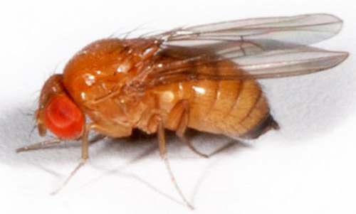
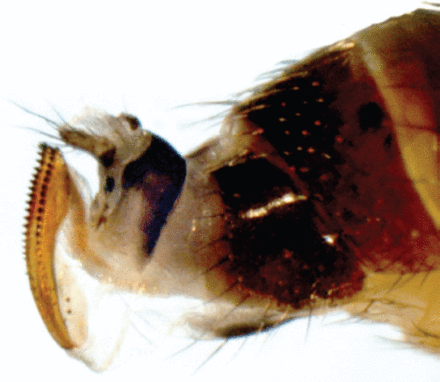
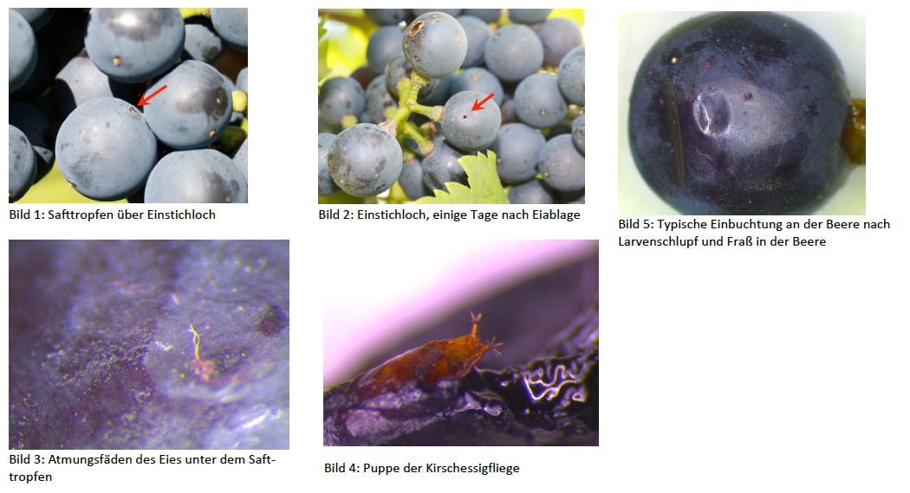
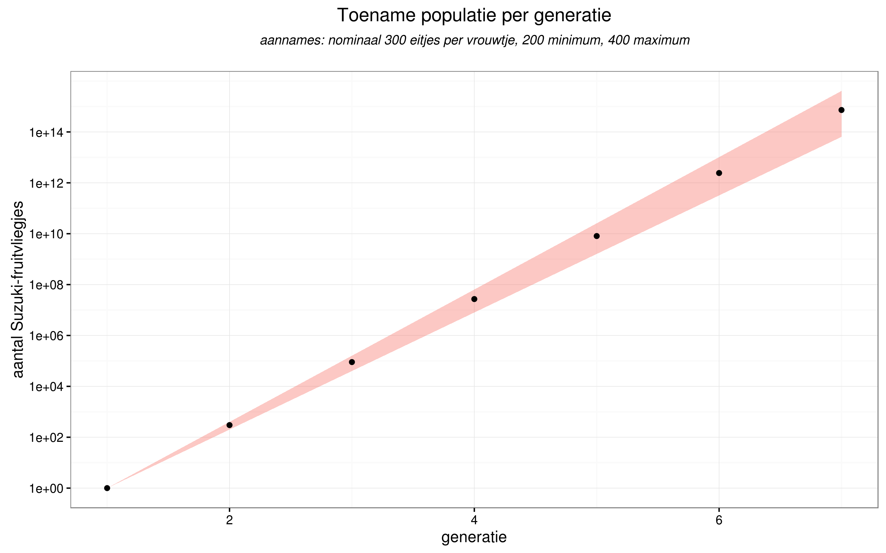
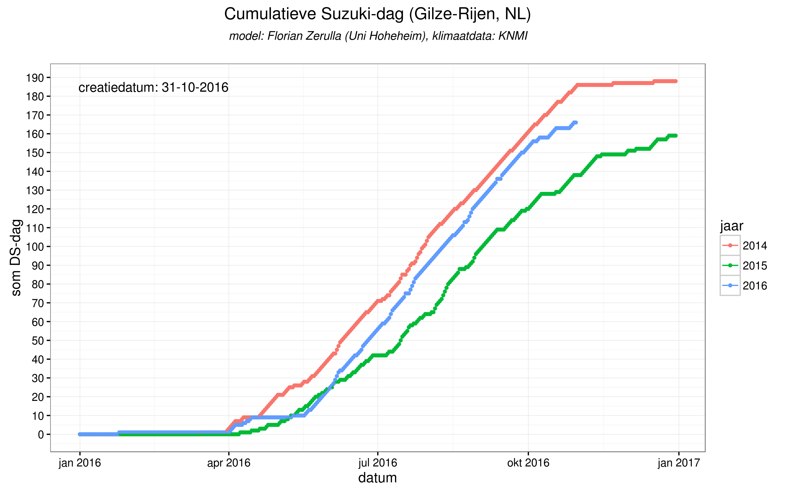
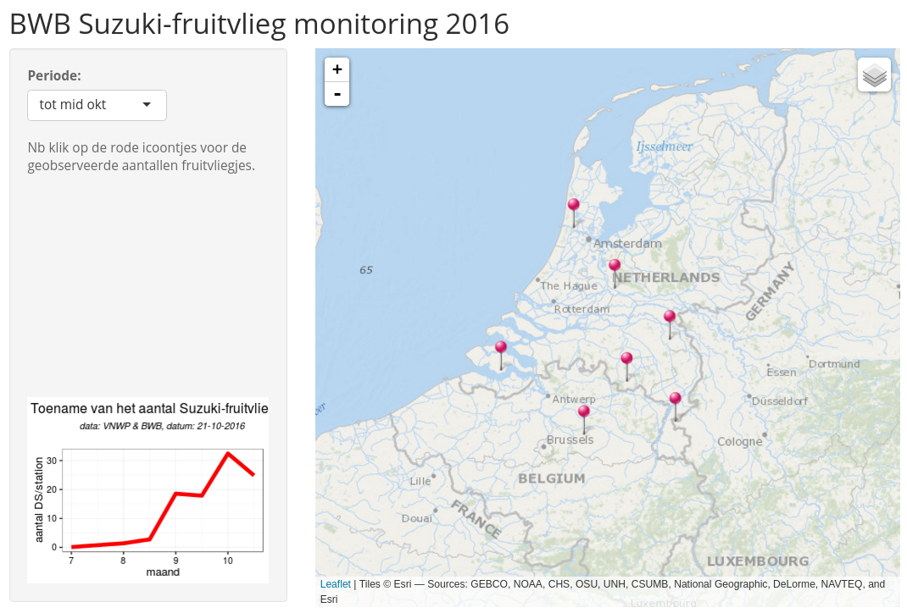

# Achtergrond van de Opdracht

## De Suzuki-fruitvlieg

Vrouwtje van de Suzuki-fruitvlieg | Mannetje van de Suzuki-fruitvlieg
---- | ----
 | 

  - nieuw plaaginsect voor de zacht-fruit sector,
  - kan in korte tijd een groot deel van de oogst vernietigen.

## Het probleem? (1/2)

Aangetast fruit leidt tot micro-biologische aantasting

  - azijn-vorming
  - rot

Fruit is onverkoopbaar/onverwerkbaar --> economische schade

## Het probleem? (2/2)

## Video Drosophila suzukii - Kirschessigfliege

<iframe width="560" height="315" src="https://www.youtube.com/embed/UsUyc4Jwzps" frameborder="0" allowfullscreen></iframe>

## Opdracht

***Een model voor de populatie-groei.***

Verwachting
  
  - populatie-groei onder controle houden dmv tijdige maatregelen,
  - maatregelen  
    obv voorspellingen (actief)  
    ipv metingen met vallen (reactief)
  - 'if all else fails': oogsten voordat de schade te groot wordt...

# Achtergrond

## Wijnbouw in Nederland (1/2)

Wijnbouw in Nederland is (opnieuw) mogelijk door de hogere temperaturen in onze regio:

  - 150 professionele wijngaarden
  - 260 hectare oppervlakte
  - 900.000 liter wijn (pm 1.3 miljoen flessen)

*[Wikipedia](https://nl.wikipedia.org/wiki/Wijnbouw_in_Nederland) cijfers 2007*

  - 516 leden (hobby en professioneel)
  - 80 hectare oppervlakte
  - 322.000 liter wijn (pm 460.000 flessen)

*[BWB](http://www.brabantsewijnbouwers.nl) cijfers 2016*

## Wijnbouw in Nederland (2/2)

Kenmerken

  - nieuwe rassen
  - kleinschalig
  - hoge kosten

waardoor een nieuwe plaag hard aankomt.

## Wijngaard Dassemus

<iframe width="560" height="315" src="https://www.youtube.com/embed/0GjhtUc-8L4" frameborder="0" allowfullscreen></iframe>

## Suzuki-fruitvliegje (1/3)

  - Drosophila suzukii (officiele naam, vaak afgekort tot 'DS')
    + ?Spotted wing Drosophila? (VS)
    + ?Kirschessigfliege? (DE, vaak afgekort tot 'KEF')
  - Japanse oorsprong
  - recente wereldwijde opmars
    + sinds 2007/2008 in Itali? en Spanje
    + sinds 2010/11 in de VS
    + sinds 2012 in Duitsland
    + sinds 2014 in **Nederland**

## Suzuki-fruitvliegje (2/3)

  - weinig natuurlijke vijanden
  - hoge reproductiesnelheid (300-350 eitjes per vrouwtje)
  - snel opeenvolgende generaties (30 dgn)

Resultaat:

## Suzuki-fruitvliegje (3/3)

Alleen slecht nieuws?

Stagnatie van reproductiesnelheid

  + $T_{gem} < 10^o C$
  + $T_{gem} > 35^o C$
  + $RV_{gem} < 80 %$

    
## Wijnbouw maatregelen

  - loofwand open (zon & wind)
  - onderbegroeing kort (droog)
  - druivenschil verharden (waterglas)
  - waardplanten verwijderen (ondoenlijk...)
  - spuitmiddel (2x/jaar, schadelijk voor bijen...)
  - **?**

# Modellen

## Bestaande modellen

Enkele eenvoudige en meer complexe modellen voor de populatiegroei

  - ?Predicting when Spotted Wing Drosophila begins activity using a Degree-day Model, Len Coop et al.?.
  - ?Integrating Temperature-Dependent Life Table Data into a Matrix Projection Model for Drosophila suzukii Population Estimation?,

Gebaseerd op slechts ??n parameter; de temperatuur (in zogenaamde graaddagen).

Parameters zoals de relatieve luchtvochtigheid en de windkracht worden genegeerd.

## BWB-poging (1/2)

Graaddag (maat voor "positieve dag voor de ontwikkeling van de fruitvlieg") uitbreiden met:

  1. gemiddelde dag temperatuur  
    + ongunstig als gemTemp < 10 of > 32,
    + zeer gunstig als 20 <= gemTemp <= 23,
    + anders gunstig,
  2. (gemiddelde) relatieve vochtigheid:
    + ongunstig als gemRelVocht < 65%,
    + anders gunstig
  3. (maximum) wind;
    + ongunstig als maxWind > 8m/s (5 Beaufort),
    + anders gunstig.                
    

## BWB-poging (2/2)

?Suzuki-dag?: DDds = DDtemp x DDrelvocht x DDwind  

conclusie: 2014 al vanaf vroeg in het seizoen gunstiger voor DS dan 2015.

## Opties

***Levenscyclus D. suzukii meenemen in model***

**Eileg per wijfje**  
7-16 eieren/dag  
384 eieren max. in 3-9 weken  
per vrucht: 3 eieren/wijfje  
eileg van meerdere wijfjes in 1 vrucht mogelijk: tot 50 larven gevonden in 1 vrucht  
Eileg in de morgen en avond uren, vanaf ongeveer april/mei afhankelijk status van vruchten  

**Larve**  
na 12-72 u uit ei (afh. van T?)  
3 larvale stadia in fruit: 3-13 dagen  

**Pop**
in de vrucht of op het oppervlak ervan; 3-15 dagen  
Pop verlaat fruit;  
volwassen vliegen 3-15 dagen later  

**levenscyclus**  
afhankelijk temp en RV  
Van ei tot adult:  
Snelste : ? 8 dagen  
Gemiddeld: ? 20-30 dagen  

## Data

Monitoringsdata:

  1. BWB monitoringsprogramma (csv-formaat: [train  2015](http://www.brabantsewijnbouwers.nl/starnet/media/downloads/Wijnbouw/BWB_DS_monitoring.csv), test 2016)
  2. Uni Freiburg [monitoringsprogramma (web-hacking)](http://www.vitimeteo.de/monitoring/fallenfaenge.shtml)

Klimaatdata:

  - [KNMI daggegevens van het weer in Nederland](http://www.knmi.nl/nederland-nu/klimatologie/daggegevens)
  - [Deutscher Wetterdienst](ftp://ftp-cdc.dwd.de/pub/CDC/Readme_intro_CDC_ftp.pdf)

  
[BWB monitoring](https://bwbdata.shinyapps.io/BWB_monitoring_Japanse_fruitvlieg)