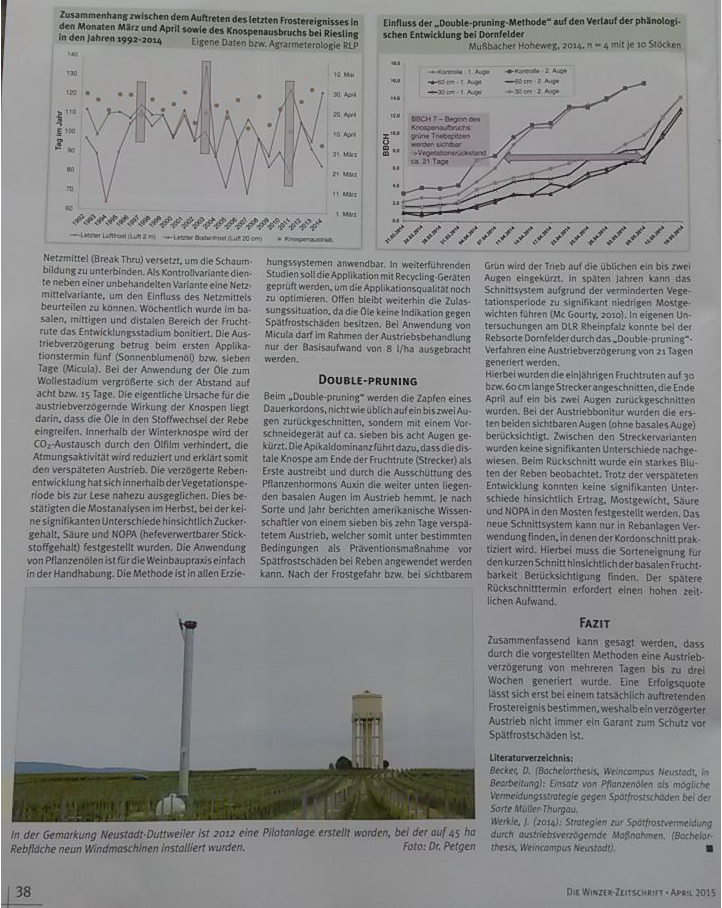

# Doel

Onderzoek naar mogelijkheden om de uitloop van druivenstokken in het voorjaar te vertragen.

# Achtergrond

Druivenstokken lopen uit, afhankelijk van druivenras en onderstam, van begin tot eind april/begin mei. Omdat de druivenstok wordt uitgebogen op zo'n 60 à 70 cm boven de grond, is de uitlopende stok (met name tussen het zwellen en het wol-stadium) erg kwetsbaar voor een late nachtvorst.

De kans op een late nachtvorst is aanwezig tot eindapril/begin mei (zie grafiekje)

Er zijn een aantal methoden bekend om de uitloop te vertragen, zoals behandeling van de stokken met een (minerale) olie voorafgaand aan het wolstadium van de knop (voor het eerste groen verschijnt), maar de effectiviteit van deze middelen is niet bekend. De achterliggende gedachte is dat de oliefilm ervoor zorgt dat de knop minder CO2 kan ademen, waardoor de uitloop vertraagt met 5 dagen tot meer dan 10. Er zouden verder geen nadelige effecten zijn.  

Wij zouden graag willen weten welke middelen het effectiefst zijn, wat het optimale tijdstip van behandeling is, hoeveel uitstel in uitlopen is te bereiken en of er korte en lange termijn gevolgen zijn voor de ontwikkeling van de druif.  
Kortom, is dit een methode waarmee kan worden bereikt dat de plant bij nachtvorst eind april/begin mei nog voldoende beschermd blijft tegen nachtvorstschade.

# Opzet

Behandeling van een aantal rijen met verschillende typen olien (begin maart tot april, uiteraard afhankelijk van de temperatuur) en veldmetingen tot begin mei. Wanneer iets langer wordt geobserveerd kan men ook vaststellen of een latere uitloop wel of niet resulteert in een langzamere algehele ontwikkeling (bijvoorbeeld latere bloei).

In de literatuur genoemde olien:

  1. zonnebloem olie
  2. parafine-olie
  3. koolzaad olie
  4. en het product "Micula", wsl een olie met uitvloeier.

dosering is rond de 8L/ha.

# Literatuur

